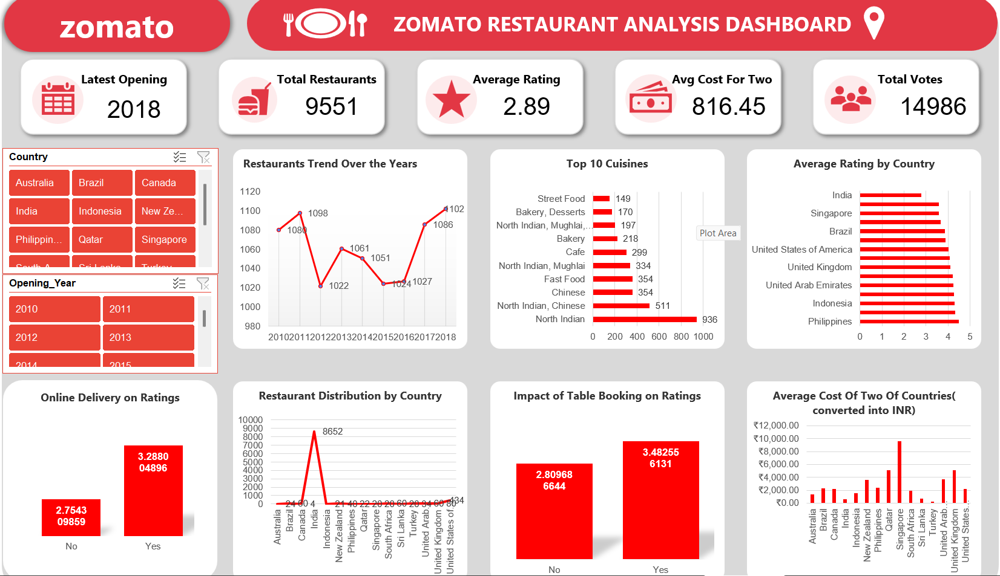

# 🍽️ Zomato Restaurant Data Analysis

## 📌 Project Overview

This project presents an end-to-end analysis of Zomato restaurant data using Microsoft Excel. The objective of the project is to analyze restaurant distribution, ratings, cuisines, pricing, customer preferences, and market competition to generate data-driven business insights and expansion recommendations.

The project includes data cleaning, lookup functions, Excel formulas, Pivot Tables, charts, and an interactive dashboard.

---

## 🎯 Business Objective

The main objective of this project is to analyze Zomato restaurant data and help management make better business decisions regarding restaurant expansion.

The analysis focuses on:

- Identifying countries with lower restaurant competition
- Recommending suitable countries and cities for restaurant expansion
- Evaluating restaurant quality based on customer ratings
- Analyzing average food expenditure across markets
- Identifying major competitors and low-rated restaurants
- Finding cuisines associated with better customer feedback
- Understanding factors that influence restaurant ratings

---

## 📊 Dataset Overview

The dataset contains information about **9,551 restaurants** across multiple countries.

The main dataset includes restaurant-related attributes such as:

- Restaurant ID
- Restaurant Name
- Country Code
- Country
- City
- Address and Locality
- Cuisines
- Average Cost for Two
- Currency
- Table Booking Availability
- Online Delivery Availability
- Price Range
- Aggregate Rating
- Rating Text
- Votes
- Latitude and Longitude

A separate country description table was used to map country codes with their corresponding country names.

---

## 🧹 Data Cleaning and Preparation

Before performing the analysis, the dataset was cleaned and prepared to improve data consistency and reliability.

The following steps were performed:

- Checked the dataset for missing and inconsistent values
- Handled blank values
- Standardized text-based data
- Corrected inconsistent spellings
- Converted date values into the correct date format
- Used VLOOKUP to map Country Codes with Country Names
- Created helper columns for analysis
- Extracted the opening year from restaurant opening dates

---

## 🛠️ Excel Skills and Techniques Used

The following Excel concepts were used in this project:

- Data Cleaning
- VLOOKUP
- IF Function
- AND Logical Operator
- COUNTIFS
- AVERAGE
- Array Formulas
- String Operations
- Conditional Formatting
- Pivot Tables
- Pivot Charts
- Data Filtering
- Data Sorting
- Helper Columns
- Dashboard Creation

---

## 📈 Key Analysis Performed

### 1. Country-wise Restaurant Analysis

Analyzed the number of restaurants available in each country to understand market competition and restaurant distribution.

### 2. Year-wise Restaurant Opening Trend

Analyzed restaurant openings by year to understand the growth trend of restaurants over time.

### 3. Market Expansion Analysis

Countries were evaluated using restaurant count and average customer rating.

Countries with relatively fewer restaurants and better customer ratings were considered potential expansion opportunities.

### 4. City-level Expansion Analysis

Cities within shortlisted countries were analyzed based on:

- Number of restaurants
- Average rating
- Average cost for two

This helped identify cities with lower competition and stronger customer acceptance.

### 5. Restaurant Quality Analysis

Average restaurant ratings were compared across shortlisted countries to understand current restaurant quality and customer satisfaction.

### 6. Food Expenditure Analysis

Average cost for two was analyzed across countries to understand customer spending levels and support financial planning.

### 7. Competitor Analysis

Highly rated restaurants were identified as major competitors.

Lower-rated restaurants were also analyzed to identify potential market gaps and opportunities for providing better food quality and customer experience.

### 8. Cuisine Analysis

Different cuisine categories were compared based on average ratings to understand whether cuisine choice influences customer feedback.

---

## 🔍 Key Insights

- India has the highest restaurant count in the dataset, indicating a highly saturated market.
- The Philippines shows strong restaurant quality with high average customer ratings.
- Indonesia combines strong ratings with comparatively controlled food expenditure.
- Qatar represents a potential premium restaurant market.
- Sri Lanka has comparatively low average food expenditure.
- Several cities in the Philippines and Indonesia show strong ratings with relatively fewer restaurants.
- Highly rated restaurants can be used as benchmarks for service quality and customer experience.
- Cuisine selection can influence restaurant ratings and customer feedback.

---

## 💡 Business Recommendations

- Prioritize markets with lower competition and strong customer ratings.
- Consider the Philippines and Indonesia for potential expansion opportunities.
- Use high-rated restaurants as benchmarks for food quality and service standards.
- Focus on cuisines associated with better customer feedback.
- Improve online delivery and table booking services where market demand exists.
- Maintain competitive pricing based on the average cost for two in the target market.
- Focus on customer experience, hygiene, service quality, and consistency to compete with established restaurants.

---

## 📊 Dashboard

An interactive Excel dashboard was created to summarize the major findings of the Zomato restaurant analysis.

The dashboard provides a consolidated view of restaurant distribution, ratings, cuisines, cost analysis, and other important business metrics.

### Dashboard Preview

---

## 📂 Project Files

- `Zomato_Project_Excel.xlsx` - Excel workbook containing data cleaning, formulas, Pivot Tables, analysis, and dashboard.
- `Zomato_Project_Documentation.docx` - Detailed documentation containing objective and subjective analysis.
- `Zomato_Project_Presentation.pptx` - Final project presentation containing key insights and business recommendations.

---

## 🚀 Tools Used

- Microsoft Excel
- Pivot Tables
- Pivot Charts
- Excel Formulas and Functions
- Data Visualization
- GitHub

---

## 📚 Project Type

**Data Analytics Portfolio Project**

---

## 👤 Author

**Saket Jha**

Aspiring Data Analyst | Python | SQL | Excel | Power BI
